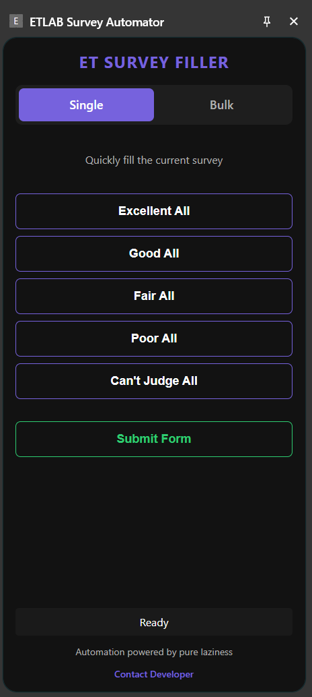

# ET Survey Filler 🚀

**ET Survey Filler** is a premium Chrome Extension designed to automate faculty feedback surveys on the ETLAB student portal. It eliminates the tedious task of manually clicking through hundreds of radio buttons by providing an intelligent, one-click automation experience.

---

## ✨ Key Features

- **🎯 Precision Auto-Fill**: Intelligently identifies questions like *Subject Knowledge*, *Behavior*, and *Sincerity* to apply the correct rating (Excellent, Good, Fair, etc.).
- **🔄 Bulk Mode**: The "Killer Feature"—one click to automatically iterate through your entire teacher list. The script opens each survey, fills it, submits, and moves to the next teacher until finished.
- **📱 Persistent Side Panel**: Uses the modern Chrome Side Panel API, so the controls stay visible even while you navigate between pages.
- **🎨 Premium UI**: A sleek, dark-themed interface with interactive button highlights and a branded purple/green aesthetic.
- **⚖️ Smart Mapping**: Recognizes diverse answer types like "Pleasant," "Sincere," "Less than 10," and "Just Right."
- **🛠️ Testing Sandbox**: Includes a `mock_survey.html` file to safely test the extension without affecting your real academic record.

---

## 🚀 How to Install

1. **Download/Clone** this repository to your local machine.
2. Open Chrome and navigate to `chrome://extensions/`.
3. Enable **Developer mode** (toggle in the top-right corner).
4. Click **Load unpacked** and select the project folder.
5. **CRITICAL**: If you want to test on the `mock_survey.html` file locally, click "Details" on the extension and enable **"Allow access to file URLs"**.

---

## 📖 How to Use

### Single Mode
1. Open a teacher evaluation survey on ETLAB.
2. Open the **ET Survey Filler** side panel (click the extension icon).
3. Click your desired rating (e.g., **Excellent All**).
4. Review the auto-filled answers and click **Submit Form**.

### Bulk Mode
1. Go to the teacher evaluation **List Page**.
2. Switch to the **Bulk** tab in the side panel.
3. Select your target rating and click **Start**.
4. Sit back and watch as the extension completes your entire semester evaluation in seconds!

---

## 🛠️ Technical Overview

- **Manifest V3**: Built with the latest Chrome Extension standards.
- **MutationObserver**: Uses DOM observation to handle dynamic content and SPA-like transitions in the portal.
- **Heuristic Page Detection**: Distinguishes between list pages and survey pages by analyzing element patterns (tables vs. radio groups).

---

## 👨‍💻 Developer

**Developed by [mhdaslam.me](https://mhdaslam.me/)**  
Feel free to reach out for feedback or support!

📧 **Email**: [mhdaslamktd@gmail.com](mailto:mhdaslamktd@gmail.com)  
🌐 **Portfolio**: [mhdaslam.me](https://mhdaslam.me/)

---

*Automation powered by pure laziness. 😉*
